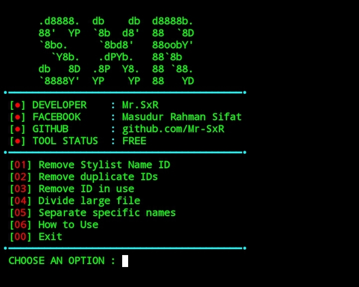

# Installation

```
cd $HOME
rm -rf Mr_SxR
git clone --depth=1 https://github.com/Mr-SxR/Stylist_rmv.git
cd Stylist_rmv
git pull
python Run.py
```
# Contact

- **Facebook**: [Masudur Rahman Sifat](https://www.facebook.com/sxr.404)
- **WhatsApp**: [Mr.SxR](https://wa.me/+8801858094178)

# Overview


